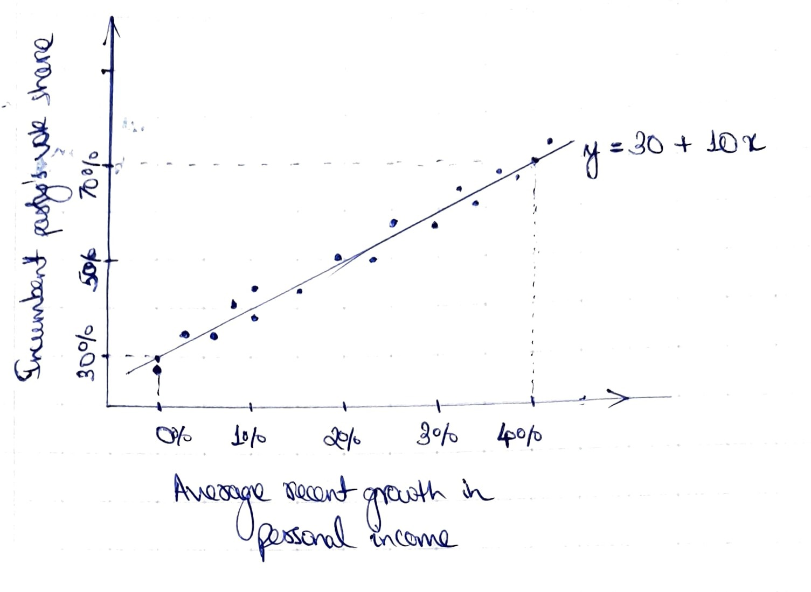
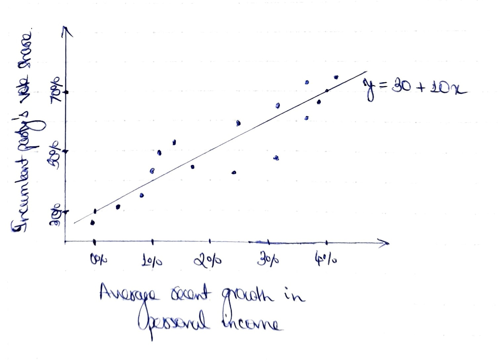

```{r setup, include=FALSE}
knitr::opts_chunk$set(echo = TRUE)
knitr::opts_chunk$set(fig.pos = "!H", out.extra = "")
```

## Answer 1

(a)
```{r 1a}
print(seq(0, 20, by = 0.2))
```

(b)
```{r 1b}
print(runif(1, min = 0, max = 10))
```

(c)
```{r 1c}
print(runif(10, min = 0, max = 10))
```


## Answer 2

(a)
```{r 2a}
a <- c("Magnus Carlsen", "Hilary Hahn", "Linus Torvalds", "Persi Diaconis")
```

(b)
```{r 2b}
sample(a, 1)
```

(c)
```{r 2c}
x <- seq(0, 10, by = 0.5)
y <- sqrt(x)
plot(x, y)

```

(d)
```{r 2d}
x <- seq(0, 10, length.out = 500)
y <- sqrt(x)
plot(x, y, type = "l")

```

(e)
```{r 2e}
x <- seq(0, 20, length.out = 500)
y <- data.frame(
  y1 = sqrt(x),
  y2 = 2.5 + sqrt(x)
)
matplot(x, y, type = "l", col = c("blue", "red"), lty = 1)
```


## Answer 3

{width=350px}
{width=350px}

## Research homework assignment
Research homework assignment

Suppose that $X$ and $Y$ are independent (real) random variables admitting
densities $f_X$ and $f_Y$, and let $Z = X/Y$.
We will say that $Z$ has Cauchy tails when $f_Z (z) \sim C/z^2$ as $|z| \to
\infty$ for some $C > 0$.

**Proposition 1:** Suppose that $\mathbb{E}[|X|] < \infty$, and that $f_Y$ is bounded.
If $f_Y$ is continuous at $0$ with $f_Y(0) > 0$, then $Z = X/Y$ has Cauchy tails with $$
  f_Z(z) \sim \frac{f_Y(0) \:\mathbb{E}[|X|]}{z^2} \quad\text{as } |z| \to \infty.
$$
_Proof:_ Observe that the density $f_Z$ of $Z$ is given by $$
  f_Z (z) = \int_\mathbb{R} |y| f_X(z y) f_Y(y) \:dy
    = \frac{1}{z^2} \int_\mathbb{R} |x| f_X(x) f_Y\left(\frac{x}{z}\right) \:dx.
$$
This can be seen by applying change of variables on $(X, Y)$ using the map
$(x, y) \mapsto (x/y, y)$, whose inverse is $(z, y) \mapsto (z y, y)$, and computing
the marginal.

Let $f_Y < M$, so $$
  |x| f_X(x) f_Y\left(\frac{x}{z}\right) < |x| f_X(x) M \in L^1(\mathbb{R})
$$ via $\mathbb{E}[|X|] < \infty$.
By the Dominated Convergence Theorem, we have $$
  \lim_{z \to \infty} z^2 f_Z(z)
    = \lim_{z \to \infty} \int_\mathbb{R} |x| f_X(x) f_Y\left(\frac{x}{z}\right) \:dx
    = \int_\mathbb{R} |x| f_X (x) f_Y(0) \:dx
    = f_Y(0) \:\mathbb{E}[|X|]. \tag*{$\square$}
$$

_Remark:_ In the special case that $X, Y \sim N(0, 1)$, we have $X/Y \sim \text{Cauchy}(0, 1)$.

Note that Proposition 1 does not cover situations such as $Y \sim \text{Uniform}(0, 1)$.
The continuity assumption on $f_Y$ can be relaxed slightly by dealing with the left and right tails of $Z$ separately.

**Proposition 2:** Suppose that $\mathbb{E}[|X|] < \infty$, and that $f_Y$ is bounded.
If $f_Y$ has both left and right limits at $0$, then $Z = X/Y$ has a Cauchy right tail with $$
  f_Z(z) \sim \frac{f_Y(0^-) \:\mathbb{E}[X^-] + f_Y(0^+)\:\mathbb{E}[X^+]}{z^2} \quad\text{as } z \to +\infty,
$$
and a Cauchy left tail with $$
  f_Z(z) \sim \frac{f_Y(0^+) \:\mathbb{E}[X^-] + f_Y(0^-)\:\mathbb{E}[X^+]}{z^2} \quad\text{as } z \to -\infty.
$$

_Proof:_ Following the same argument as in Proposition 1, we use the Dominated Convergence Theorem on $$
  z^2 f_Z(z)
    = \int_{-\infty}^0 |x| f_X(x) f_Y\left(\frac{x}{z}\right) \:dx
      + \int_0^{+\infty} |x| f_X(x) f_Y\left(\frac{x}{z}\right) \:dx. \tag*{$\square$}
$$

_Remark:_ Note that $Z = (1/Y) / (1/X)$, so Proposition 2 has an analogue which demands $\mathbb{E}[1/|Y|] < \infty$ and that the density of $1/X$ have both left and right limits at $0$.