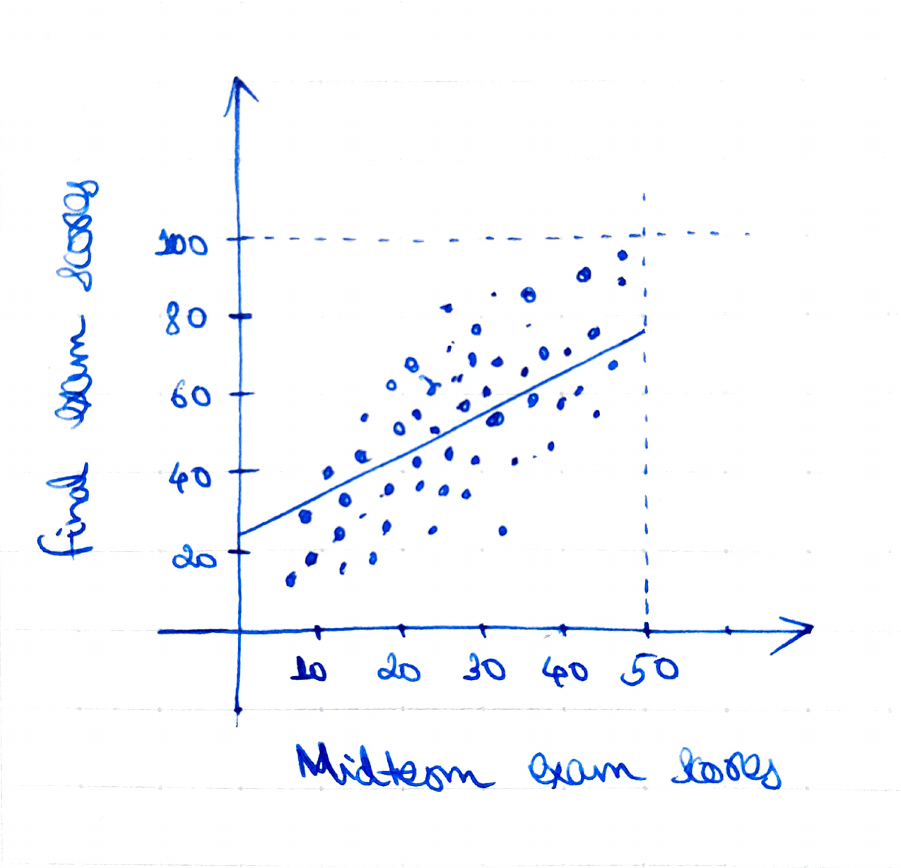
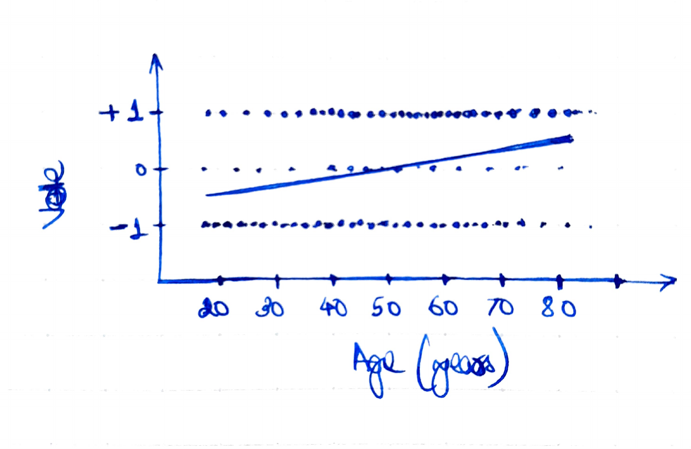

```{r setup, include=FALSE}
knitr::opts_chunk$set(echo = TRUE)
knitr::opts_chunk$set(fig.pos = "!H", out.extra = "")
```

## Answer 1

(a)
``` {r 1a, message = FALSE}
n <- 100
a <- 1      # intercept
b <- 2      # slope
sigma <- 3  # residual standard deviation
x <- runif(n, min = 0, max = 4)
y <- a + b*x + sigma * rnorm(n)
df <- data.frame(x, y)

library(rstanarm)
fit.y <- stan_glm(y ~ x, data = df, refresh = 0)
print(fit.y)
```

To check whether or not the true coefficients lie within one standard deviation of the estimates, we do the following.
``` {r 1a check}
a.hat <- coef(fit.y)[1]
b.hat <- coef(fit.y)[2]
a.se <- se(fit.y)[1]
b.se <- se(fit.y)[2]

abs(a.hat - a) < a.se
abs(b.hat - b) < b.se
```

(b)
``` {r 1b}
plot(x, y, main = "Data and fitted regression line")
abline(a.hat, b.hat)
x.bar <- mean(x)
text(2.5, -1, paste("y = ", round(a.hat, 2), " + ", round(b.hat, 2), "*x"), adj = 0)
```


## Answer 2

(a) Following the discussion in ROS about regression to the mean dealing with exam scores, we guess that while most pairs $(x, y)$ of scores will follow the line $(x, 2x)$, the regression will yield coefficients of the form $a = 25$, $b = 1$, $\sigma = 10$.

(b) We guess that there is a shift from Democratic to Republican votes as age increases, but with the discrepancy being $60\%$-$40\$$ at most.
The independent vote is estimated to be very little, perhaps simply proportional to the age distribution (any non-zero effect of age here is perhaps too small to illustrate).
With this, we guess that our regression line passes through $(20, -0.2)$ and $(80, 0.2)$.
Thus, $a = -1/3$, $b = 1/150$, $\sigma = 1$.

{width=350px}
{width=350px}

## Answer 3

(a)
```{r 3a}
dbinom(3, 10, 0.40)
```

(b)
```{r 3b}
shots <- function(n, p) rbinom(1, n, p)
mean(replicate(10000, shots(10, 0.40) == 3))
```


## Research homework assignment

We take a first look at our height and earnings data.

```{r rha data}
earnings <- read.csv("earnings.csv")
plot(earnings$height, earnings$earn)
```

Around $10\%$ of people have $0$ earnings.
Note that a simple transformation of the form $\log(1 + y)$ places these data points in an isolated pile at the bottom.
```{r rha zero}
mean(earnings$earn == 0)
plot(earnings$height, log(1 + earnings$earn))
```

Instead, we look at the transformation $\log(A + y)$.
Temporarily, we can also look at $\log(1 + y/A)$, which differs from $\log(A + y)$ only by a constant $\log(A)$.
This also sends zeroes to zeroes.
In this new settings, we may interpret $A$ as a scaling factor (which also helps make $y/A$ dimensionless).
With this, we suggest using $A = \text{MAD}(\mathbf{y})$.

```{r rha scaled}
A <- mad(earnings$earn)
print(A)
plot(earnings$height, log(1 + earnings$earn/A))
```

We can fit this model as follows.
The coefficients can be read off of the `stan_glm` output.

```{r rha fit}
x <- earnings$height
y <- earnings$earn
y.l <- log(A + y)
df <- data.frame(x, y.l)

fit.y.l <- stan_glm(y.l ~ x, data = df, refresh = 0)
print(fit.y.l)
plot(x, y.l, xlab = "height", ylab = "log(A + earnings)")
abline(coef(fit.y.l)[1], coef(fit.y.l)[2])
```

We can also take a look at the residuals, which are approximately normally distributed.

```{r rha residuals}
residuals <- y.l - (coef(fit.y.l)[1] + coef(fit.y.l)[2] * x)
shapiro.test(residuals)
R2 <- 1 - sum(residuals^2) / sum((y.l - mean(y.l))^2)
print(R2)
hist(residuals, breaks = 16)
```

It is difficult to suggest an appropriate scaling factor $A$ for $y$ without resorting to some measure of dispersion such as the Median Absolute Deviation or standard deviation.
Choosing small values of $A$ makes the problem of separation between the $y = 0$ values from the rest of the data worse.
Choosing large values of $A$ flattens the bulk of the data far too much and stretches out the top of the plot.