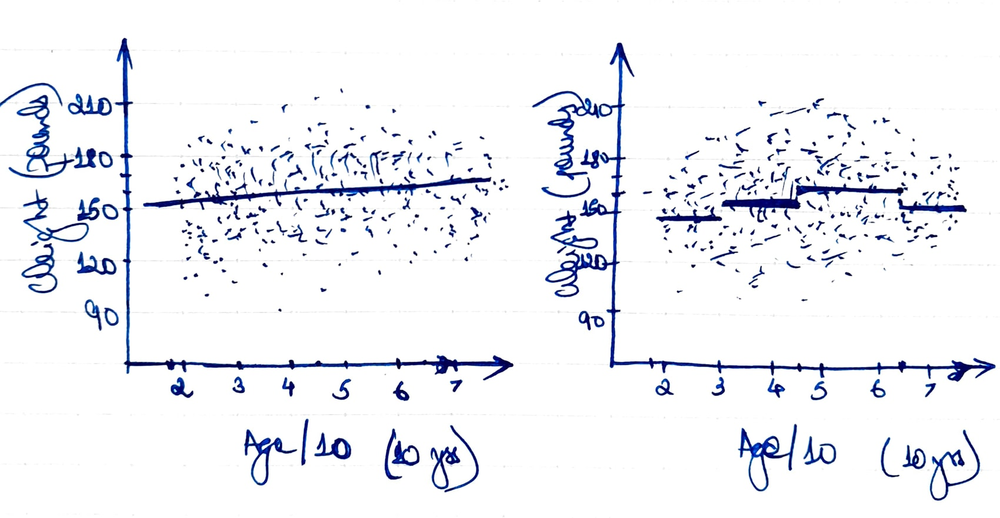

```{r setup, include=FALSE}
knitr::opts_chunk$set(echo = TRUE)
knitr::opts_chunk$set(fig.pos = "!H", out.extra = "")
```

## Answer 1

Consider the model $$
  y_i = a + b h_i + c m_i + d h_i m_i + \epsilon_i,
$$ with $\epsilon_i \overset{iid}{\sim} N(0, \sigma^2)$, and $y, h, m$ denoting
the variables _earnings_, _height_, and _male_.

We have our estimates $\hat{a} = -9.3, \hat{b} = 0.4, \hat{c} = -29.3, \hat{d}
= 0.6$.

(a) Setting $h_i' = 2.54 h_i$, we may rewrite our model as $$
\begin{aligned}
  y_i
    &= a + \frac{b}{2.54} \cdot  2.54 h_i + c m_i
        + \frac{d}{2.54} \cdot 2.54 h_i m_i + \epsilon_i \\
    &= a' + b' h_i' + c' m_i + d' \cdot h_i' m_i + \epsilon_i,
\end{aligned}
$$ so our new coefficients are $\hat{a}' = \hat{a} = -9.3$,
$\hat{b}' = \hat{b} / 2.54 = 0.16$, $\hat{c}' = \hat{c} = -29.3$, $\hat{d}'
= \hat{d} / 2.54 = 0.24$.

(b) Setting $h_i' = 2.54 (h_i - 66)$, we may write $$
\begin{aligned}
  y_i
    &= (a + 66b) + \frac{b}{2.54} \cdot  2.54 (h_i - 66) + (c + 66d) m_i
        + \frac{d}{2.54} \cdot 2.54 (h_i - 66) m_i + \epsilon_i \\
    &= a' + b' h_i' + c' m_i + d' \cdot h_i' m_i + \epsilon_i,
\end{aligned}
$$ so $\hat{a}' = \hat{a} + 66\hat{b} = 17.1$, $\hat{b}' = \hat{b} / 2.54
= 0.16$, $\hat{c}' = \hat{c} + 66d = 10.3$, $\hat{d}' = \hat{d} / 2.54 = 0.24$.

(c) Setting $y_i' = 1000 y_i$, we may write $$
\begin{aligned}
 1000 y_i
    &= 1000 a + 1000 b h_i + 1000 c m_i + 1000 d h_i m_i + 1000 \epsilon_i \\
    &= a' + b' h_i' + c' m_i + d' \cdot h_i' m_i + \epsilon_i',
\end{aligned}
$$ so $\hat{a}' = 1000 \hat{a} \approx -9300$, $\hat{b}' = 1000 \hat{b} \approx
400$, $\hat{c}' = 1000 \hat{c} \approx -29300$, $\hat{d}' = 1000 \hat{d}
\approx 600$.


## Answer 2

Given that $\sigma_x = 2$, $\sigma_y = 0.4$, and a regression model
$y = 0.2 + 0.3x + \text{error}$, we could try and use the relation $\hat{b}
= r \sigma_y / \sigma_x$ to solve for the correlation $r = \hat{b} \sigma_x
/ \sigma_y = 1.5$, which is absurd!


## Answer 3

The regression line takes $y$ values `r 148.7 + 1.8 * c(2, 4, 6, 8)` at $x$
values $2, 4, 6, 8$.

See Figure 1.




## Answer 4

(a) The means in the four groups are `r 147.8 + c(0, 9.6, 16.6, 7.5)` respectively.
    The mean in the youngest group is represented by the intercept; the three
    other regression coefficients are the differences between the mean in the
    corresponding group and the mean in the youngest group.
    Including an indicator variable for the first group would make our design
    matrix rank deficient.

(b) See Figure 1.

